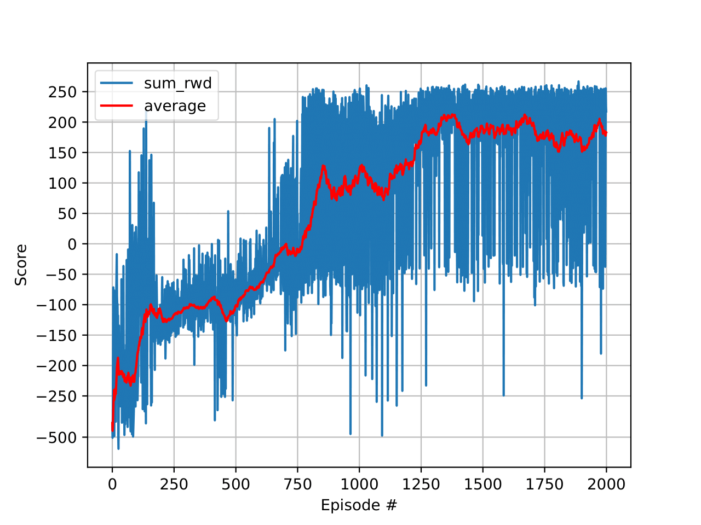

# Stabilité d'apprentissage 
Une fois l'ensemble des classes réalisé mon agent semblait avoir du mal à maintenir la politique optimale une fois apprise. Ainsi des fois le dernier modèle était sensiblement moins bon que d'autres au cours de l'apprentissage. La première idée fue d'enregistrer le modèles à intervalle régulier au cours de l'apprentissage. Une fois l'apprentissage terminer les modèle sauvegardé sont comparé sur un test sur un grand nombre d'épisodes. Seul le modèle ayant le meilleure résultat sur ce test est celui qui sera gardée. 
Ci-dessous est représenté les résultats aux tests obtenu par les différentes sauvegardes au cours de l'apprentissage.

Le problème de cette solution est qu'elle est extrêmement longue à tourner en effet comme l'écart-type entre épisodes est de l'ordre de 100 ainsi en testant sur 1000 episodes on a toujours un intervalle de confiance de l'ordre de 10. Estimer à plus ou moins 5 semble une bonne précision cependant réalisé 1000 episode de test pour chaque enregistrement de modèle rend la chose extrêmement longue. Il y aurait moyen de réduire le temps de calcul, par exemple en parallélisant ou en excluant ou arrêtant les cas trop lointain de la meilleure valeur. Mais avant d'essayer ces possibilité d'amélioration, nous avons décidé de regarder si certain hyper-paramètre permettait d'avoir une meilleure stabilité

# Compromis entre rapidité d'apprentissage et stabilité

La stabilité est très important en effet même en décidant d'appliquer la méthode proposer ci-dessus, plus le modèle sera stable et plus on pourra espacé les enregistrement du modèle et donc réduire le temps de calcul. Inversement si le modèle était fortement instable alors on serait obligé de testé quasi toutes les version du modèle ce qui représenterais un coût monstrueux en calcul.

À priori, réduire le taux d'apprentissage devrait améliorer la stabilité du modèle. Cependant réduire le taux d'apprentissage risque d'augmenter le nombre d'épisode nécessaire pour atteindre les mêmes performances. Pour estimer une bonne valeur du taux d'apprentissage nous avons fais une recherche sur plusieurs valeurs de taux d'apprentissage et de nombre d'épisodes.

Ci dessous est la représentation graphique des apprentissage pour les valeurs de taux d'apprentissage `0.1`, `0.01`, `0.001` et  `0.0001` et les valeurs de nombre d'épisode `500`, `1000`, `2000` et `4000` 

| 0.1 | 0.01 | 0.001 | 0.0001|
|:---:|:---:|:---:|:---:|
|||||

On remarque sur les résultats que même si pour `1000` épisodes le taux d'apprentissage de `0.001` semble bien moins bon que le taux d’apprentissage de `0.01` cependant en lui donnant plus d'épisodes (`2000`,`4000`) on se rend compte que le taux d'apprentissage de `0.001` est bien meilleure car il atteint des performances supérieurs et arrive à se stabiliser dessus.

# Planificateurs
Le problème de réduire le taux d'apprentissage pour augmenter la stabilité est qu'on va aussi réduire la progression du modèle en début d'apprentissage il va donc mettre beaucoup plus longtemps afin d'atteindre la même performance. 

Ce qu'on aimerais serait donc d'avoir un taux d'apprentissage haut au début pour que le modèle apprenne rapidement tout en ayant un taux d'apprentissage faible en fin d'apprentissage pour obtenir une stabilité. Pour cela on va créer un planificateur (trad. scheduler) qui va modifié le taux d'apprentissage au cours de l'apprentissage.

Le planificateur le plus simple est un planificateur qui va décroître d'un facteur multiplicatif à chaque épisode. Ci-dessous est la représentation graphique de la comparaison entre avec et sans planificateur pour l'agent DQN et l'agent DQN Target. Nous avions aussi fais la comparaison en changeant l'optimiseur utilisé (içi Adam) pour SGD cependant dans tout les cas testé le modèle convergeait vers la stratégie consistant à ne rien faire, cette stratégie a beau être meilleure que l'aléatoire elle reste peu intéressante et nous n'avons donc pas inclus les graphiques associé içi.

On remarque qu'effectivement l'utilisation d'un planificateur permet d'augmenté la stabilité sans ralentir la progression du modèle en début d'apprentissage. Ainsi Cette une bonne manière d'augmenter la stabilité sans compromettre sur la vitesse d'apprentissage

# Comparaison entre différents planificateurs

Ayant remarqué que l'utilisation d'un planificateur permettait d'améliorer la stabilité sans compromettre sur la vitesse d'apprentissage, nous avons décidé de comparer différent planificateurs. Nous avons choisis `ExponentialLR` décris précedement, `StepLR` agissant similairement au précédent mais d'un plus gros facteur mais moins souvent et `ReduceLROnPlateau` qui reduis le taux d'apprentissage lorsque le modèle atteint un plateau (ie. il n'y a pas eu d'amélioration de la performance durant les n dernier épisodes). Nous avons de plus inclus un double planificateur mélangeant `ExponentialLR` et `ReduceLROnPlateau`

| None | Step | Exponential | Reduce| Exp,Reduce|
|:---:|:---:|:---:|:---:|:---:|
||||||

Le planificateur `ReduceLROnPlateau` a une très bonne stabilité en fin mais demande de s'assurer qu'il ne se met pas à réduire le taux d'apprentissage trop tot qui pourrait empêcher totalement l'apprentissage. le combiné avec `ExponentialLR` permet d'éviter ce genre de problème en prenant des paramètre plus extrême pour `ReduceLROnPlateau`.

